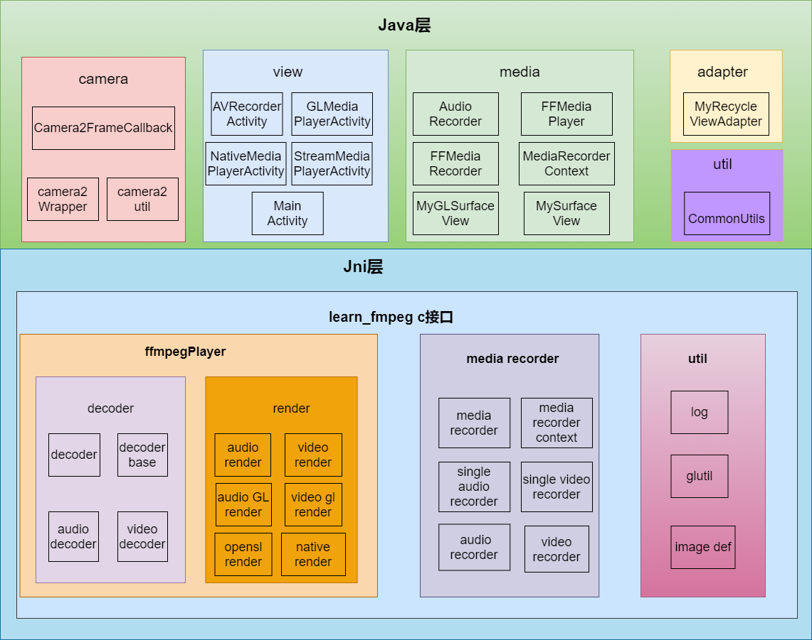
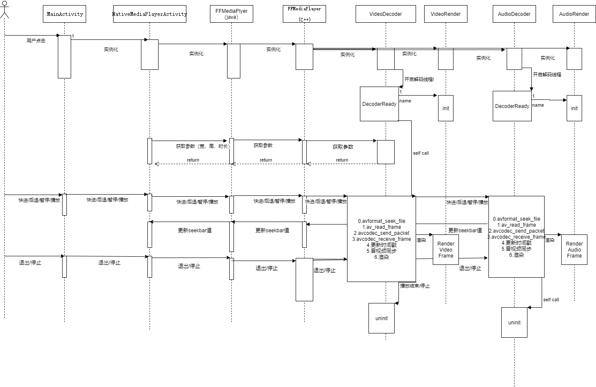
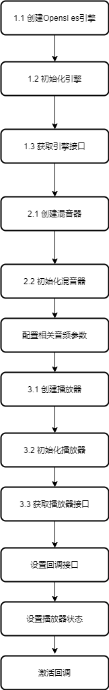

### 描述
- 本项目是基于Android平台播放器。使用C++语言，

### 功能
- 实现了opensl播放音频
- NativeWindow，opengl es的视频渲染。
- 实现了3种音频和视频同步方式
- 使用camera2对相机画面进行预览，渲染，采集，使用ffmpeg对视频编码，生成mp4文件
- 利用AudioRecorder采集PCM音频，利用ffmpeg编码生成aac文件

### 整理层次图
    

### 解码流程图
    

### opensl es基本流程
    