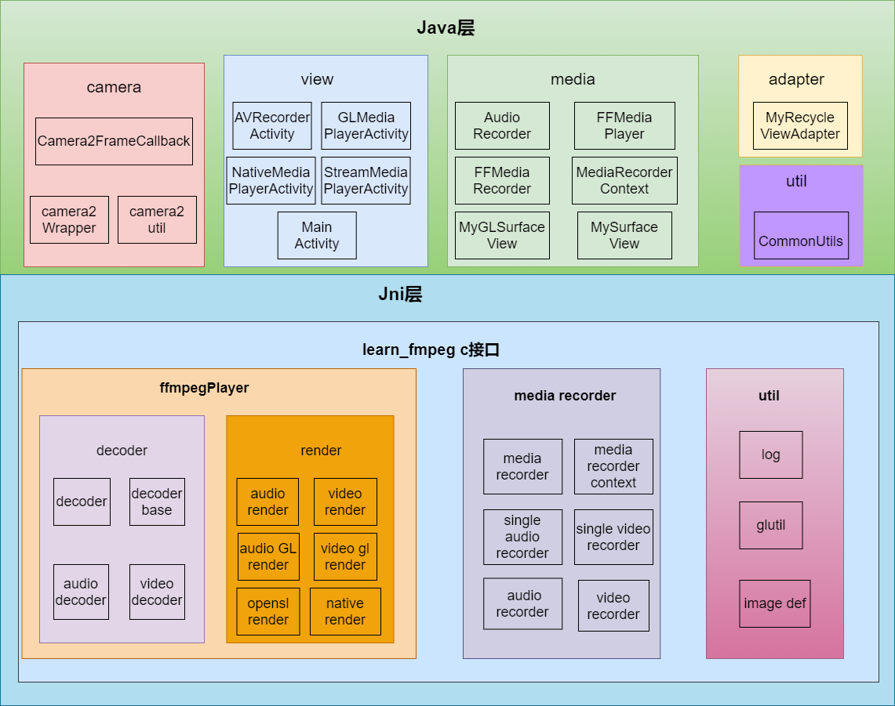
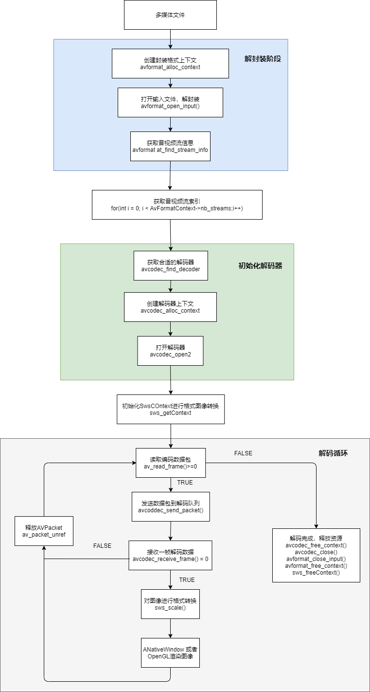
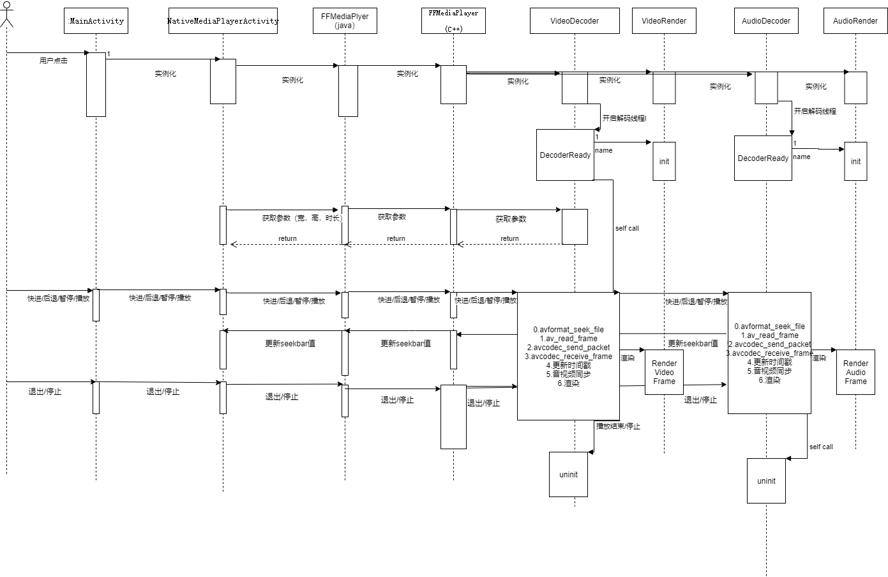
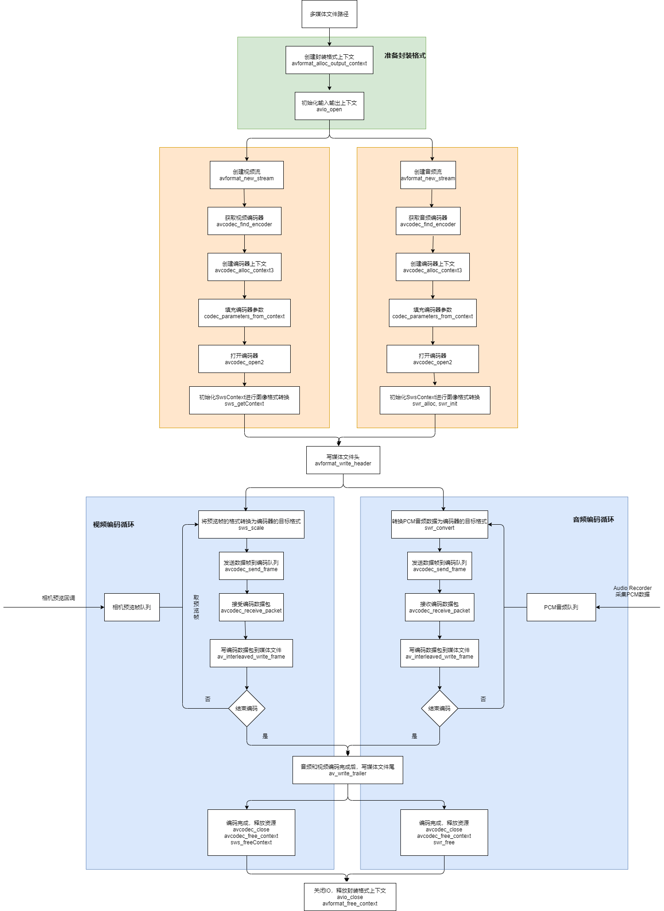
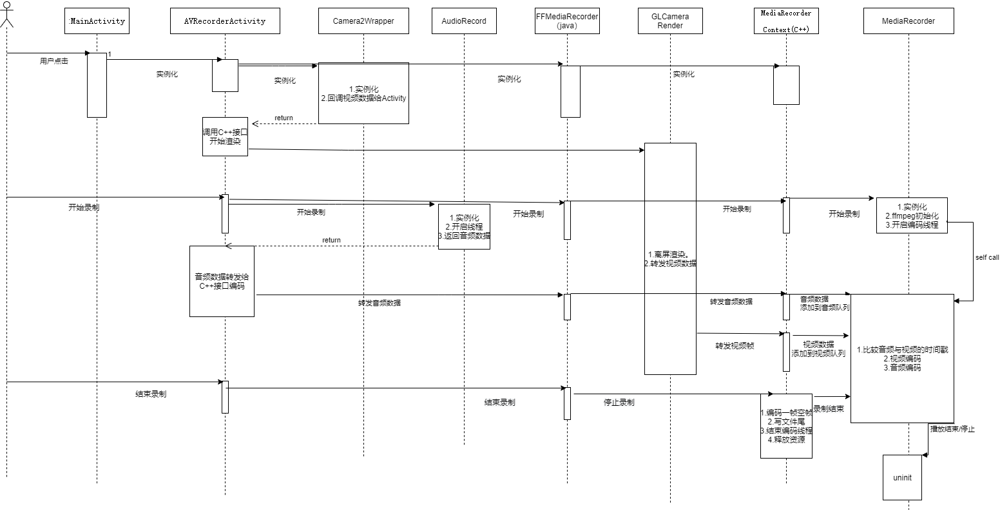
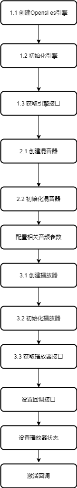

### 描述
- 本项目是基于Android平台，使用C++语言开发的播放器

### 功能
- 实现了opensl播放音频
- NativeWindow，opengl es的视频渲染。
- 实现了3种音频和视频同步方式
- 使用camera2对相机画面进行预览，渲染，采集，使用ffmpeg对视频编码，生成mp4文件
- 利用AudioRecorder采集PCM音频，利用ffmpeg编码生成aac文件

- ### 整体层次图

    

- ### 视频解码播放流程图
     

- ### 播放序列图

    

- ### 音视频编码流程图
     

- ### 采集序列图

    

- ### opensl es基本流程

    

- ### 效果图

    
